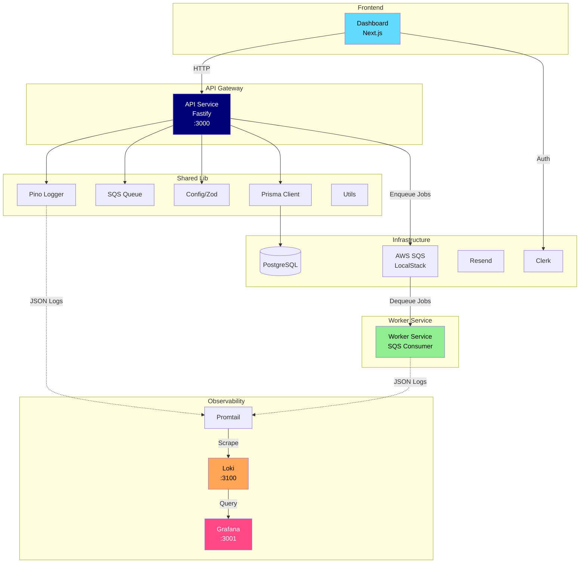

# PulsePing Architecture



## Services

| Service | Port | Description |
|---------|------|-------------|
| API | 3000 | Fastify REST API |
| Worker | - | Background job processor |
| Dashboard | 3001 (Next.js) | Web UI |
| Grafana | 3001 | Log visualization |
| Loki | 3100 | Log aggregation |
| PostgreSQL | 5432 | Database |
| LocalStack | 4566 | SQS mock |

## Quick Start

```bash
# Start all services
docker-compose up -d

# View logs
docker-compose logs -f api
docker-compose logs -f worker

# Open Grafana
# http://localhost:3001
# Username: admin
# Password: admin
```

## Environment Variables

See `.env.example` for configuration.