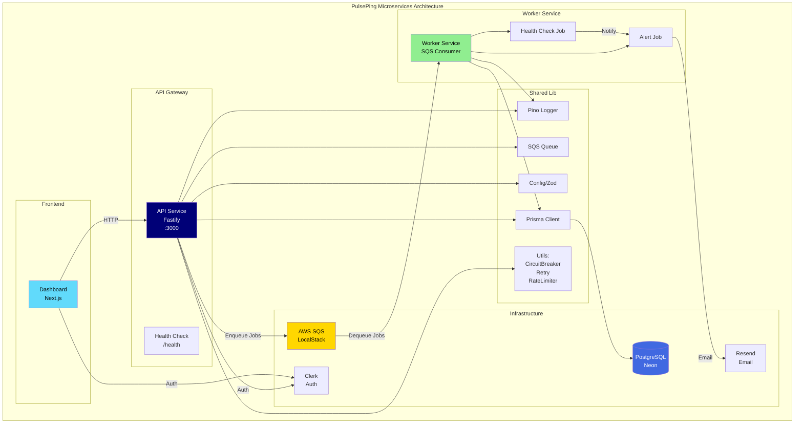

```mermaid
graph TB
    subgraph "PulsePing Microservices Architecture"
        
        subgraph "Frontend"
            D[Dashboard<br/>Next.js]
        end
        
        subgraph "API Gateway"
            API[API Service<br/>Fastify<br/>:3000]
            H[Health Check<br/>/health]
        end
        
        subgraph "Shared Lib"
            L[Pino Logger]
            Q[SQS Queue]
            C[Config/Zod]
            DB[Prisma Client]
            UT[Utils:<br/>CircuitBreaker<br/>Retry<br/>RateLimiter]
        end
        
        subgraph "Worker Service"
            W[Worker Service<br/>SQS Consumer]
            HJ[Health Check Job]
            AJ[Alert Job]
        end
        
        subgraph "Infrastructure"
            SQS[AWS SQS<br/>LocalStack]
            PG[(PostgreSQL<br/>Neon)]
            R[Resend<br/>Email]
            CL[Clerk<br/>Auth]
        end
        
        D -->|HTTP| API
        API --> L
        API --> Q
        API --> C
        API --> DB
        API --> UT
        
        API -->|Enqueue Jobs| SQS
        SQS -->|Dequeue Jobs| W
        
        W --> HJ
        W --> AJ
        W --> L
        W --> DB
        
        HJ -->|Notify| AJ
        AJ -->|Email| R
        
        DB --> PG
        
        API -->|Auth| CL
        D -->|Auth| CL
        
    end
    
    style D fill:#61dafb,color:#000
    style API fill:#007,color:#fff
    style W fill:#90EE90,color:#000
    style SQS fill:#FFD700,color:#000
    style PG fill:#4169E1,color:#fff
```